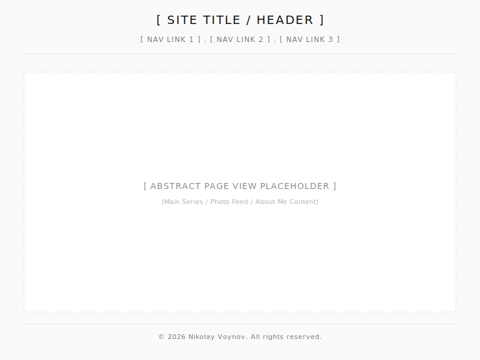
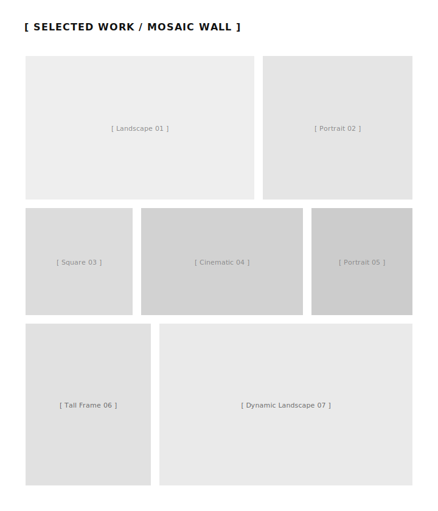
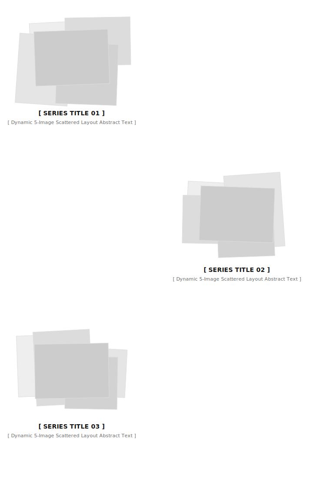
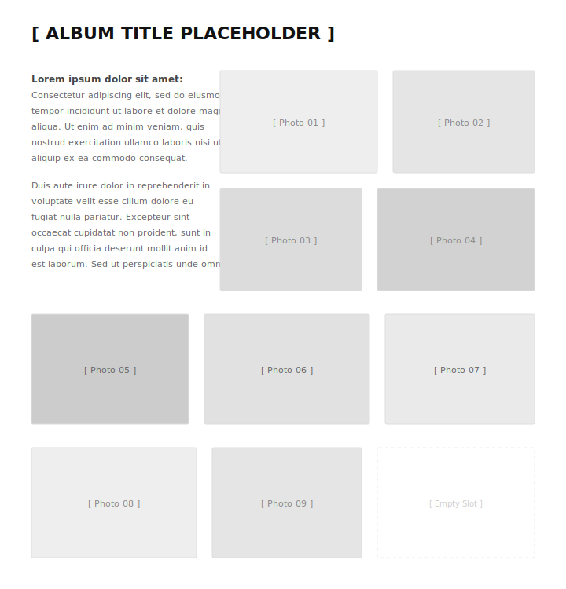
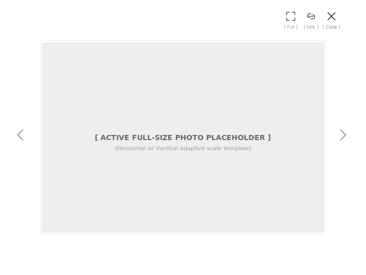

% REQUIREMENTS SPECIFICATION: EXPOSURE PORTFOLIO ENGINE
% Nikolay Voynov
% June 26, 2026

# 1. Introduction

## 1.1 Purpose

This document establishes the official software requirements specification for the **Exposure Portfolio Engine**. It defines the core data structures, behavioral boundaries, and operational constraints governing the portfolio management automation pipeline.

## 1.2 Scope

The system acts exclusively as an offline, terminal-driven object orchestration
engine. The scope is strictly bounded to metadata parsing, object aggregate
synchronization, and asset optimization pipelines, intentionally omitting web
server capabilities, database storage engines, and graphical administration
interfaces.

## 1.3 Problem Statement

**The problem of** inefficient, error-prone manual conversion and cataloging of
  high-resolution photographic archives for portfolio deployment **affects** independent photographers managing standalone portfolio presentations. **The impact of which is** massive operational time loss, inconsistent metadata presentation across web platforms, and a severe risk of data degradation or accidental overwrite of author-curated text sheets during synchronization events.

**A successful solution would be** a lightweight, deterministic, terminal-operated pipeline that guarantees idempotent data asset synchronization, protects author-curated content, and automatically enforces fine-art presentation standard layouts.

## 1.4 Product Statement

**For** independent fine-art photographers and media curators **who** require an efficient, secure way to transform local master photo archives into optimized presentation streams **the Exposure Engine is** a simple and effective pipeline utility **that** automatically harvests EXIF metadata, enforces custom storyboard sequences, protects curated narratives, and bakes web-ready asset prints.

**Unlike** generic static site generators or complex CMS platforms which demand tedious manual configuration or introduce runtime database vulnerabilities **our product** seamlessly separates the author's local curation space from the production deployment environment, ensuring 100% data immutability.

# 2. Domain Model & Narrative Overview

The domain of the Exposure system operates on the concepts of traditional exhibition photography translated into a digital medium. Instead of chaotic folder structures and raw file arrays, the domain space is strictly organized as a **Gallery**, which consists of independent **Albums**.

## 2.1 Process and Data Lifecycle

Each Album represents a completed author's series or a dedicated exhibition hall. Within the album, the physical reality of the storage drive — **Master Images** — meets the artistic context provided by the author.

The data processing workflow is divided into three distinct phases:

1. **Discovery & Extraction:** The system scans the physical directory, reads the shooting chronology, and harvests technical parameters (hardware data, focal length, exposure speed) directly from the embedded metadata print of the frame. This forms the baseline technical ledger of the album.
2. **Curation Manifesto:** The author enriches the raw files with artistic context. At this phase, the **Narrative Story** (the comprehensive artistic text of the album) is captured, and the **Storyboard** (a rigid, immutable sequence of frames defining the narrative rhythm of the series) is locked. Individual photographs can be assigned unique accent titles and localized captions.
3. **Optimization & Release:** The system compiles domain objects into release artifacts, converting heavy master source files into lightweight web-ready optimized prints prepared for presentation to the external world.

# 3. Stakeholder Analysis

This section identifies the key individuals, groups, or technical entities that influence the system or are influenced by its operational behavior. Analyzing these bidirectional relationships prevents functional gaps in the pipeline architecture.

## 3.1 Artist / Gallery Owner

The central figure of the ecosystem, combining the roles of end-user, system operator, and product owner.

* **Influence on the System:** Dictates curation rules, directly structures the content layout via local text ledgers, defines the directorial storyboard sequence, and initiates synchronization events.
* **System's Influence on the Stakeholder:** Eradicates repetitive technical routine (compression, sharpening, metadata harvesting), guarantees absolute safety of written creative narratives, and provides a clear, version-controlled text interface.

## 3.2 The Public / General Web Audience

The ultimate consumers of the visual product browsing the gallery across a wide variety of desktop, tablet, and legacy mobile viewports.

* **Influence on the System:** Enforces non-functional requirements regarding page rendering speed, pixel-perfect image compression quality, and responsive layout fluidity (preventing accidental vertical grid splits or empty gaps on small screens).
* **System's Influence on the Stakeholder:** Delivers a clean, meditative, and uncluttered viewing experience (the digital passe-partout effect) without runtime errors or CMS interface clutter.

## 3.3 Search Engine Crawlers (e.g., Googlebot, Bingbot)

Automated external software agents responsible for indexing the website content to make the gallery discoverable on the web.

* **Influence on the System:** Demand semantic, lightweight HTML output, absolute URL resource pointers, proper keyword metadata injection, structural sitemaps, and clean directory paths to ensure high indexing scores.
* **System's Influence on the Stakeholder:** Translates flat domain attributes (multilingual keywords, descriptions, titles) into highly searchable static text release releases, bypassing dynamic Javascript rendering roadblocks entirely.

## 3.4 Global Social Media & Communication Networks (e.g., Facebook, X, Telegram)

External digital platforms where gallery links are shared by viewers, critics, or the artist to gain visibility and audience reach.

* **Influence on the System:** Impose strict metadata presentation criteria, requiring specific Open Graph header formatting and a mandatory, valid preview image layout (e.g., the 2x2 collage) to generate engaging sharing snippets.
* **System's Influence on the Stakeholder:** Serves perfectly prepared, individual series preview blocks (`og_album_cover.jpg`), ensuring that shared links look professional, retain title context, and actively drive click-through traffic.

## 3.5 Fine-Art Print Purchaser / Art Collector (Prospective Role)

A premium segment of the web audience interested in acquiring certified physical copies of the exhibited masterpieces.

* **Influence on the System:** Acts as a business driver for introducing granular image metadata boundaries — enforcing that while most files remain minimal, exclusive frames are assigned explicit titles, localized print-ready descriptions, and sales-funnel routing.
* **System's Influence on the Stakeholder:** Provides an elegant, authoritative, and conceptually transparent presentation deck, making it easy to identify premium works and explore their artistic backgrounds.

## 3.6 System Developer / Software Maintainer

The engineering party responsible for the code health (the artist acting as an architect).

* **Influence on the System:** Sets decoupled structural boundaries (Hexagonal Ports), enforces strict domain object immutability, and mandates clean coding metrics.
* **System's Influence on the Stakeholder:** Demands highly testable, cohesive classes, encourages strict Test-Driven Development (TDD), and minimizes third-party dependency overhead to preserve long-term code stability.

# 4. User Requirements

## 4.1 Web preseentation

### 4.1.1 Universal Visual Hierarchy Layout

The system shall provide a unified web presentation layout based on a strict axial museum design template.

The top layout boundary shall contain a centralized typographic signature block dedicated to the global site title and author identity metadata.

Aligned directly along the central axis beneath the main identifier, the interface shall include a single-row, non-wrapping horizontal navigation menu providing direct user access to the core workspace entry points.

The system shall render a lightweight horizontal divider line beneath the navigation matrix to visually isolate the header infrastructure from the main fluid content viewport.

### 4.1.2 Main Portfolio Wall (Index)

The system shall present the primary index page of the fine-art portfolio as an unbordered, fluid masonry grid matrix.

The interface shall render individual artwork tiles sequentially to form a continuous visual tapestry entirely free of solid framing boundaries or cell padding.

The presentation layer shall implement a dynamic, responsive grid layout system that recalculates tile scales on the fly to prevent empty spaces or misaligned elements across all desktop and mobile viewports.

When a user triggers a click event on an individual artwork tile, the interface shall temporarily suspend the index flow and smoothly reveal the asset within the fullscreen presentation system.

### 4.1.3 Series Catalog Directory (Series)

The system shall provide a series catalog directory page that aggregates all publicly visible photography albums into an independent narrative workflow.

 Each album entry in the directory shall contain a visual preview component alongside the series text data block. The visual preview component shall render a layered, overlapping stack containing exactly five representative thumbnails from that series to emulate the tactical feedback of reviewing an analog film portfolio layout.

On desktop layouts, the interface shall position these preview sheets with intentional horizontal and vertical layout shifts.

On mobile devices, the interface shall enforce strict vertical and horizontal boundary constraints, packing the five preview plates into a tight fan stack that completely eliminates empty vertical gaps and prevents text overlapping.

To the right of this visual component, the layout shall render the series title and the localized conceptual narrative text block.

### 4.1.4 Individual Album Showcase (Album View)

The system shall compile an individual album showcase view focusing on a single, isolated artistic series theme.

The top layout section shall print the primary series header title followed directly by the full-length creative narrative manifesto text block.

### 4.1.5 Fullscreen Presentation System (Lightbox)

The system shall provide an ultra-lightweight fullscreen presentation lightbox interface running as a modal overlay layer detached from the main background website flow.

The system shall isolate a single optimized image print asset against a dark, minimalist, low-contrast viewport to maximize visual concentration on the artwork tones.

The underlying lightbox script logic shall be stripped of heavy external tracking or framework dependencies, relying on native web browser interactions to execute rapid transition switches between frames.

## 4.1 UR-50 Album Import

The system builds an explicit metadata scaffold for every imported album to drive its standalone public web presentation. When the system imports an album folder, it executes an initial automated discovery sweep to extract baseline technical parameters. The system allows the gallery owner to manually modify any curated album attribute within local configuration ledgers.

### 4.1.1 Album Metadata Composition

The imported album metadata scaffold extends the base system parameters with the dirname location where images are placed, a cover image mapping, the images collection data, and a storyboard sequence array governing the directorial viewing rhythm.

The child image metadata block provides a filename matching the physical master source file, an artistic title accent that defaults to an empty string, a localized individual print caption description, and an absolute timestamp capturing the exact moment of exposure.

When an imported master image file contains embedded EXIF tags, the system automatically extracts and maps the title, description, and creation time fields into the initial fresh snapshot state.

### 4.1.2 Album Synchronization Context

Original albums change over time as the gallery owner adds new images, edits metadata, deletes existing master files, updates the album cover, or re-arranges the visual flow. The system synchronizes the current portfolio state with the physical source drive archive to reflect these changes.

### 4.1.3 Merging Identity Principles

When the gallery owner initiates a synchronization event, the system merges the fresh physical disk snapshot with the existing saved configuration state, applying the absolute priority of human curation over automated defaults.

When the synchronization loop detects newly appended master image files on the hard drive, the system creates baseline metadata entries for them and integrates their filenames into the existing storyboard sequence based on their absolute creation timestamp metrics. The system analyzes the chronological placement of each new frame and inserts its filename placeholder directly into the correct historical position relative to already curated assets, preserving the established sequence layout while maintaining strict overall timeline coherence.

When the synchronization loop detects a missing or cleared metadata parameter in the author's local ledger, the system preserves the user's empty field instead of re-injecting raw EXIF or system defaults.

When the system detects a ghost image record that is no longer physically present inside the source disk directory, the system completely purges that image entry from the metadata collection.

When a ghost image filename is removed during synchronization, the system automatically strips its occurrences from the storyboard sequence and re-evaluates the album cover fallback pointer to prevent broken asset links.

# 5 Functional requirements

## 5.1 Entities

### 5.1.1 Model::Image (Leaf Domain Entity)

The fundamental atomic element of the domain space capturing metadata parameters for a singular photographic print file. It acts as an immutable value object, meaning its state cannot be altered after initialization.

| Attribute | Data Type | Multiplicity | Constraints | Default | Description |
| :--- | :--- | :--- | :--- | :--- | :--- |
| **filename** | String | 1 | Must include a valid file extension. Cannot be blank. | *None (Required)* | The exact physical filename of the master image file on the local storage system (e.g., `frame_01.tif`). |
| **title** | String | 1 | Safe textual characters. | `""` | A custom artistic accent title assigned to the photograph. Defaults to an empty string to preserve a clean minimalist visual space. |
| **description** | String | 1 | Safe textual characters. | `""` | An individual caption, background story, or printing technical data specific to this individual frame. |
| **keywords** | String | 1 | Comma-separated tokens. | `""` | A flat string of comma-separated search optimization tokens specific to the frame, parsed as a single string field. |
| **genre** | String | 1 | Short classification code. | `""` | Individual photography classification category tag overriding the global series parameters. |
| **location** | String | 1 | Free text characters. | `""` | Exact localized spot, territory, or coordinate context mapping where the specific frame was captured. |
| **created_at** | Timestamp | 1 | Must be a valid absolute chronological date and time value. | *None (Required)* | The absolute timestamp capturing the exact moment of exposure, structured using the strict ISO 8601 profile. |

### 5.1.2 Model::Album (Series Node Aggregate)

An aggregate entity representing an independent coherent series of photographic works, mapped directly to an isolated directory on the physical storage system. It coordinates the directorial timeline workflow and binds artistic text narratives with child image structures.

| Attribute | Data Type | Multiplicity | Constraints | Default | Description |
| :--- | :--- | :--- | :--- | :--- | :--- |
| **dirname** | String | 1 | Must match the exact local operating system folder naming criteria. Cannot be blank. | *None (Required)* | The physical directory name of the album folder located on the local hard drive archive path. |
| **slug** | String | 1 | Must be lowercase and contain only web-safe alphanumeric characters and hyphens. | *None (Required)* | The unique canonical URL identity router path matching international web presentation standards. |
| **title** | String | 1 | Safe textual characters. Cannot be blank. | *None (Required)* | The human-readable primary name of the photography series or gallery exhibition hall. |
| **description** | String | 1 | Safe textual characters. | `""` | A concise localized abstract summarizing the core theme, context, or time boundaries of the series. |
| **story** | String | 1 | Valid Markdown formatted text blocks. | `""` | The extensive long-form creative narrative, exhibition background statement, or artistic manifesto. |
| **keywords** | String | 1 | Comma-separated tokens. | `""` | A flat string of global comma-separated metadata tokens describing the photography series as a whole. |
| **genre** | String | 1 | Short classification code. | `""` | The primary fine-art photography category classification tag for index grouping and structural layout sorting. |
| **location** | String | 1 | Free text characters. | `""` | General geographical territory, country, city, or gallery space marker where the series originated. |
| **cover** | String | 1 | Must point to a valid existing filename from the album's image pool. | *None (Required)* | The explicit target master filename designated to represent the album as its main visual thumbnail or poster. |
| **hidden** | Boolean | 1 | Boolean flag (`true` or `false`). | `false` | A structural publication filter that hides the entire album from public static site output when enabled. |
| **images** | Collection<Model::Image> | 0..* | Items must be valid unique Image entity objects. Sequential order must be preserved. | `[]` | The rigidly sequenced collection of child Image entities defining the final directorial storyboard workflow layout. |

### 5.1.3 Model::Gallery (Root Domain Aggregate)

The top-level execution boundary object encapsulating the synchronized state of the entire photographic portfolio collection. It acts as the primary query entry point for any publication or optimization task pipelines.

| Attribute | Data Type | Multiplicity | Constraints | Default | Description |
| :--- | :--- | :--- | :--- | :--- | :--- |
| **cover** | String | 1 | Must point to a valid relative web-safe image asset path context. | `""` | The main visual thumbnail, poster, or generated mosaic collage representing the entire fine-art gallery portfolio on index streams. |
| **albums** | Collection<Model::Album> | 0..* | Items must be valid unique Album aggregate objects. Sorting sequence must follow chronological configuration rules. | `[]` | The comprehensive root collection of all synchronized valid Album aggregates belonging to the fine-art portfolio. |
  
### 5.1.4 Parameters (Global System Configuration Entity)

A single structural dataset containing global parameters that dictate media optimization boundaries, processing constraints, and fallback runtime metrics for uninitialized data trees.

| Attribute | Data Type | Multiplicity | Constraints | Default | Description |
| :--- | :--- | :--- | :--- | :--- | :--- |
| **gallery_path** | String | 1 | Must be a valid existing folder route descriptor within the local operating system environment. | `""` | Absolute or relative system route to the source photography master archive folder where source images are located. |
| **max_short_side** | Integer | 1 | Must be a positive integer greater than zero, representing pixel values. | `1080` | Maximum bounding width or height constraint in pixels for optimized production image web-rescaling. |
| **unsharp_enabled** | Boolean | 1 | Boolean flag (`true` or `false`). | `true` | Publication flag activating the unsharp mask post-processing contrast sharpening filter kernel. |
| **unsharp_spec** | String | 1 | Must follow exact underlying engine processing kernel argument parameters validation. | `"0x0.5+0.8+0.02"` | Raw command specification parameters string syntax for the unsharp post-processing sharpening matrix. |
| **supported_formats** | String | 1 | Comma-separated alphanumeric characters. Cannot be blank. | `"tif,tiff,jpg,jpeg"` | Comma-separated list of raw or compressed master graphics file extensions allowed for automated discovery scanning. |
| **default_album_keywords** | String | 1 | Comma-separated tokens. | `"series, art"` | Fallback text keywords line injected as global metadata metadata properties into brand new discovered albums. |
| **default_image_keywords** | String | 1 | Comma-separated tokens. | `"photo"` | Fallback text keywords line injected as local metadata metadata properties into brand new discovered individual images. |
| **default_genre** | String | 1 | Short classification code. | `"landscape"` | Fallback primary fine-art photography category classification tag applied to uninitialized series blocks. |
| **default_location** | String | 1 | Free text characters. | `"Kyiv, Ukraine"`| Fallback default geographical territory or coordinate context location mapping applied to newly discovered frames. |
  
## User Interfaces

### 5.2.1 Command Line Interface (CLI) Infrastructure

The system operates exclusively via an offline command-line terminal environment, providing the gallery owner with a deterministic, low-overhead management control panel. The CLI infrastructure translates automated tasks into atomic, fail-fast pipelines that validate system environments and binary dependencies before modifying any data assets.

#### 5.2.1.1 Gallery Sync Command (Import Pipeline)

The automated import pipeline is triggered by executing the central synchronization command within the portfolio workspace. When initiated, this command forces the engine to run a strict environmental check to verify that all underlying infrastructure utilities are present and executable in the global environment path. Upon successful validation, the system executes a chronological metadata discovery sweep across local image archives, materializes existing author curation states, resolves timeline offsets for newly discovered assets, and securely refreshes the human-readable text ledger sheets on disk.

#### 5.2.1.2 Gallery Deploy Command (Publication Pipeline)

The automated publication pipeline is initiated by executing the central deployment command within the terminal. When triggered, the system invokes the full media compilation suite to transform heavy master archives into web-ready compressed formats, bakes individual album and master wall Open Graph collage layout matrices, and generates monolithic metadata markdown files. Once the compilation sequence finishes without warnings, the system automatically packages the finalized static asset tree and pushes the entire presentation footprint to the configured remote fault-tolerant hosting platform, updating the live public portfolio in a single transaction.
  
## 5.3 Web Presentation Interface Requirements

TODO: write generic section about seo-optimization, especially for series page and individual images.

  
# 5. Assumptions and Dependencies

## 5.1 Total Cost of Ownership (TCO) Constraints

Because the project is designed as an open utility for independent creators and enthusiasts, a strict economic operational constraint is enforced — minimizing the total cost of ownership to a near-zero threshold:

1. **Zero-Infrastructure Cost:** The system must not require paid runtime components. Dedicated application servers, database engines, and paid SaaS content management platforms are strictly excluded.
2. **Infrastructure Independence:** The compiled production content targets a static website format. This enables the use of completely free, fault-tolerant, and globally distributed static hosting platforms (such as GitHub Pages, GitLab Pages, Netlify, or Cloudflare Pages).
3. **Local Tools Maximization:** The computational workload for transforming heavy media streams is fully delegated to the author's local workstation, utilizing native free CLI operating system utilities (`exiftool`, `imagemagick`).

## 5.2 Operating System Environment Dependencies

The synchronization and media compilation tasks assume the availability of a POSIX-compliant terminal subsystem (Linux/macOS) with pre-installed binary executables of ImageMagick (supporting WebP compilation) and ExifTool accessible via the system's global PATH environment variable.

## 5.3 Technical stack

The following techs assumed

- Jekyll Static Site Geenerator
- Ruby 3.4 for gallery sinchornization
- exifTool for extracting EXIF information
- ImageMagick for image manipulations
- Podman a container management (to aviod the necessity to insall all that stuff locally)

===
У меня есть изменения к лайтбоксу, и мы сейчас их здесь сформулируем. 

Также давай добавим еще одно "профессионральное" требование здесь, которое требует разработать что-то похожее на бренд-бук (я не знаю что это такое на самом деле, но ассоциация что это некое концептуальное видение)

Звучать будет что-то вроде так "Перед проектированием визуальной части стайта, необходимо создать "бренд-бук"

Пока останемся в требованиях к интерфейсу пользователя. Ты пропустил макет для страницы альбома - давай сделаем. Также немного по другому у нас выглядит страница серий. Напомню, коллаж из пяти изображений, под ним имя серии, несколько серий хаотически разбросаны, одна ниже другой. Можешь что-то подобное восрпоизвести в svg?
